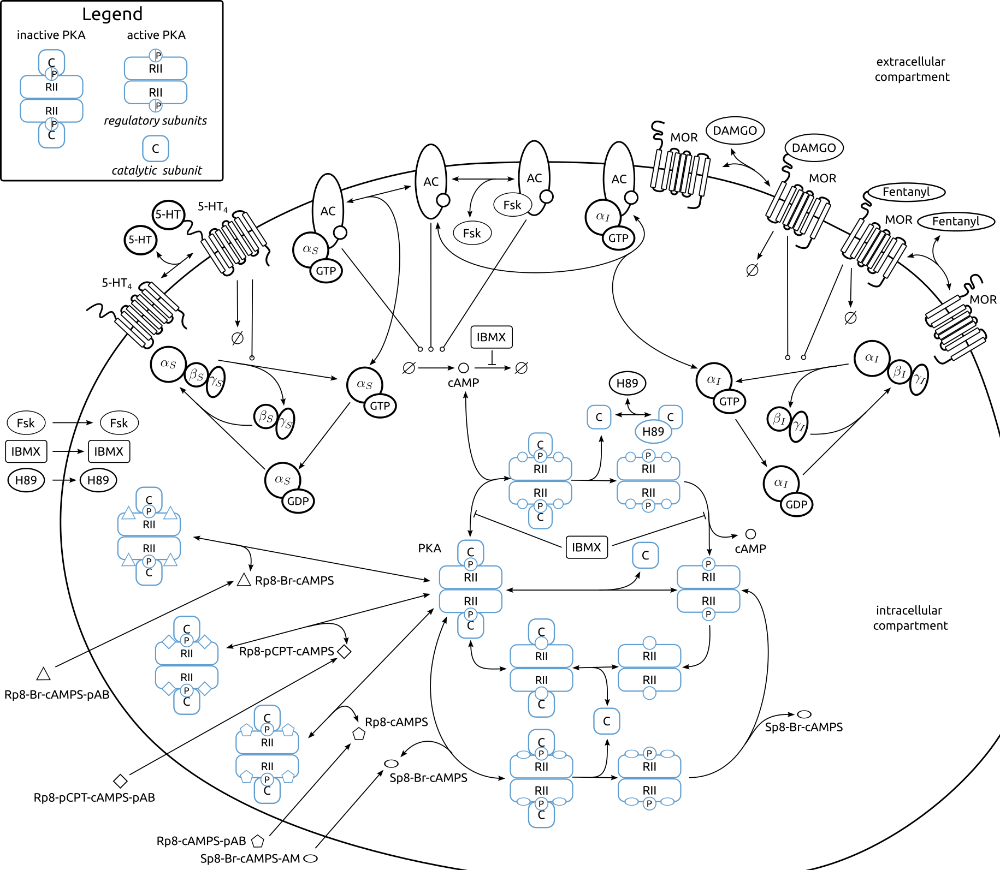

# A mechanistic model of protein kinase A dynamics under pro- and anti-nociceptive inputs

This repository contains all python files and (supplementary) figures for the manuscript 
"A mechanistic model of protein kinase A dynamics under pro- and anti-nociceptive inputs".



## Requirements
This project relies on the following key software packages:

  - [PEtab](https://github.com/PEtab-dev/libpetab-python) (v0.7.0)
  - [AMICI](https://github.com/AMICI-dev/AMICI) (v0.34.2)
  - [pyPESTO](https://github.com/ICB-DCM/pyPESTO) (v0.5.7)
  - [Fides](https://github.com/fides-dev/fides) (v0.8.0)

The analysis was performed using Python 3.11.1. Additional dependencies are listed in `requirements.txt`, 
which can be installed with 
```bash 
pip install -r requirements.txt
```
The listed versions correspond to those used in this study. 

## Models and parameter estimation problems
We developed a mechanistic model of PKA activity in nociceptive neurons that explicitly links 
receptor activation to downstream kinase regulation. The model is implemented in the Systems Biology Markup Language ([SBML](https://sbml.org/)), 
and the parameter estimation problem was described in the [PEtab format](https://github.com/PEtab-dev/PEtab). 
PEtab is a standardized format for specifying parameter estimation problems in systems biology. 
It combines a dynamic model (typically in SBML format) 
with tab-separated values (TSV) files for descriptions of experimental data, 
simulation conditions, observables, and parameters, enabling reproducible model calibration and 
benchmarking across different software tools.

PEtab files for the core model of PKA activity in nociceptive neurons are located in
- `model/petab`  
  The model captures ligand-dependent receptor
  activation, subsequent G-protein signaling, and its regulatory effects on AC activity and
  cAMP synthesis, ultimately linking these processes to PKA activation through cAMP
  binding. The SBML model definition is provided in the file `PKAcycleMOR_model.xml`. 
  This file is identical across all nested folders and is duplicated for convenience when performing 
  model validation and running _in silico_ experiments. 
  The model parameters that are required for model simulation are specified in `parameters_PKAcycleMOR.tsv`.
  - `in_silico_exp`  
    This folder contains PEtab files for _in silico_ experiments shown in Figure 7. 
    The `measurementData_PKAcycleMOR.tsv` file in this folder contains placeholder values for the measurements, 
    which are not used for parameter estimation.
  - `validation`  
    This folder contains PEtab files for simulating the conditions contained in the validation set.
    This was used to generate Figure 6. Files `measurementData_PKAcycleMOR_only_validation.tsv` and 
    `exp2/measurementData_exp2.tsv` contain measurements that were only used for model validation.
    Files `measurementData_PKAcycleMOR_only_validation__smooth.tsv` and `exp2/measurementData_exp2_smooth.tsv` 
    in this folder contain placeholder values for the measurements, that were used for model simulation.
  - `experimentalCondition_PKAcycleMOR.tsv`  
    [Condition table](https://petab.readthedocs.io/en/latest/v1/documentation_data_format.html#condition-table). 
    Conditions ending in `_\d+` (e.g. `model1_data1_1`-`model1_data1_9`) are added to the table for simulation and visualization purposes.
    All other conditions describe conditions of actually performed experiments.
  - `measurementData_PKAcycleMOR.tsv`  
    [Measurement table](https://petab.readthedocs.io/en/latest/v1/documentation_data_format.html#measurement-table) that contains experimental measurements that were used for parameter estimation (the training dataset). 
    Comparisons between model simulations and experimental data contained in this file are shown in Figure 3.
  - `measurements_smooth.tsv`  
    Measurement table for model simulation and visualization, including additional time points and conditions to enable finer resolution and smoother trajectories.
    Measurement values at the additional time points are placeholders and are not used for parameter estimation.
    Actual experimental measurements are contained in `measurementData_PKAcycleMOR.tsv`.
  - `observables_PKAcycleMOR.tsv`  
    [Observables table](https://petab.readthedocs.io/en/latest/v1/documentation_data_format.html#observables-table).
  - `parameters_PKAcycleMOR.tsv`  
    [Parameter table](https://petab.readthedocs.io/en/latest/v1/documentation_data_format.html#parameter-table). 
    The best parameter values found during model calibration are reported in the `nominalValue` column.
  - `PKAcycleMOR.yaml`  
    [YAML file for grouping files](https://petab.readthedocs.io/en/latest/v1/documentation_data_format.html#yaml-file-for-grouping-files).
  - `PKAcycleMOR_model.xml`  
    [SBML model definition](https://petab.readthedocs.io/en/latest/v1/documentation_data_format.html#sbml-model-definition).
  - `visualizationSpecification_PKAcycleMOR.tsv`  
    [Visualization table](https://petab.readthedocs.io/en/latest/v1/documentation_data_format.html#visualization-table).

PEtab files for the extended model are located in
- `model/petab_feedback`  
  An additional reaction for G<sub>I</sub> protein activation, 
  with a rate proportional to the concentration of the pRII<sub>2</sub>:cAMP<sub>4</sub> complex was added to the core model.
  This folder contains PEtab files for _in silico_ hypothesis testing shown in Figure 8.

- `model/copasi`  
  This folder contains the COPASI model definition of the core model for most datasets used for parameter estimation.
  In each file, the parameter values were configured to match the corresponding experimental conditions, 
  and all estimated parameters were set to the values of the best-fitting parameter vector. 
  The dataset numbering corresponds to the numbering used in Figure 3.

## Scripts

This repository includes several analysis scripts in `src/` used to run optimization, ensemble predictions and generate the paper figures. Short descriptions:

- `src/optimization.py`  
  Implements the startpoint sampling, parameter estimation, saving results to HDF5, simulation with best parameter vectors, and profile posterior calculations. Key entry points: `sample_startpoints()`, `optimize()`, `simulate_w_best_parameter()` / `simulate_and_visualize()`, and `create_profiles()`.
  Figure 2a and b were generated using `simulate_and_visualize()`. 
  Figure 4 was generated using `visualize_profile_confidence_intervals`.

- `src/in_silico_experiments.py`  
  Driver script for running in‑silico experiments (uses the PEtab problem in `petab/in_silico_exp`). It builds ensembles from optimization results and produces ensemble visualizations and state trajectory plots via `create_prediction()` and the plotting helpers in `src/ensemble.py`.
  Figure 7 was generated using this script.

- `src/feedback_hypothesis.py`  
  Utilities for exploring the proposed feedback mechanism: simulate state trajectories from chosen parameter vectors, write flux tables (per-condition), and plot G-protein activation flux contributions. Useful functions include `simulate_states_petab()`, `write_fluxes()`, and `visualize_Gactivity_flux()`.
  Figure 8 was generated using this script.

- `src/ensemble.py`  
  Core ensemble utilities: construct ensembles (from optimization endpoints or histories), predict observables and full state trajectories for all ensemble members, and state visualizations.
  Figures 2 and 5 were generated using this script, as well as the Supplementary Figure S4.

- `src/visualization.py`  
  Helper functions for plotting and visualizing simulation results, including observables and state trajectories. Used by `optimization.py`, `in_silico_experiments.py`, and `feedback_hypothesis.py`.

- `src/validation.py`  
  Driver script for simulating the validation dataset (uses the PEtab problem in `petab/validation`). It produces visualizations of the validation data and model predictions.
  Figure 6 was generated using this script.
